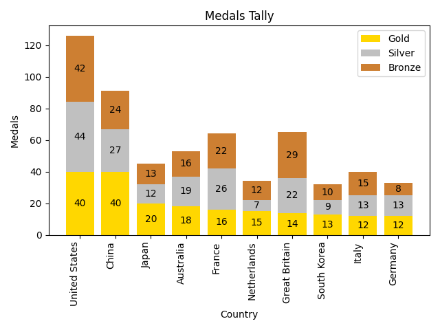

# Demographicmedals

## Intro

🎯 Explore and explain olympic medal winning using demographic data, espacially medals per capita

🎯 In ~10 min using cutting edge genAI tools 
- Github Copilot
- Copilot for web

## Reasoning with AI

---

**You:**

Create a table with current medal tally for Paris Olympics

**Copilot:**

Executing Task:

Create a CSV file with the top 10 countries and their medal tally from the Paris 2024 Olympics. The columns should be Country, Gold, Silver, Bronze, and Total.

Sure! Here’s the current medal tally for the Paris 2024 Olympics:

| Rank | Country        | Gold | Silver | Bronze | Total |
|------|----------------|------|--------|--------|-------|
| 1    | United States  | 30   | 38     | 35     | 103   |
| 2    | China          | 29   | 25     | 19     | 73    |
| 3    | Australia      | 18   | 14     | 13     | 45    |
| 4    | France         | 14   | 19     | 21     | 54    |
| 5    | Great Britain  | 13   | 17     | 21     | 51    |
| 6    | South Korea    | 13   | 8      | 7      | 28    |
| 7    | Japan          | 13   | 7      | 13     | 33    |
| 8    | Netherlands    | 11   | 6      | 8      | 25    |
| 9    | Italy          | 10   | 11     | 9      | 30    |
| 10   | Germany        | 9    | 8      | 5      | 22    |

This table includes the top 10 countries based on their total medal count.

Is there a specific country or athlete you’re following in the Olympics?

---

**You:**

Is there a trustworthy source of data where you can find the number of inhabitants in 2023 for each country?

**Copilot:**

Yes, there are several trustworthy sources where you can find the population data for each country in 2023. Here are a few reliable options:

1. **Worldometer:** This website provides up-to-date population statistics for all countries, based on the latest United Nations estimates.
2. **Database.earth:** This platform offers detailed population data for 2023, including the most populous countries and regions.
3. **Population Reference Bureau (PRB):** Their 2023 World Population Data Sheet includes comprehensive population, health, and environment indicators for over 200 countries.

These sources are well-regarded for their accuracy and reliability. Is there a specific country or region you’re interested in?

---

**You:**

Please complete the table with the number of inhabitants per country, using Database.earth as a source.

**Copilot:**

Here’s the updated medal tally table for the Paris 2024 Olympics, now including the number of inhabitants per country based on data from Database.earth:

| Rank | Country        | Gold | Silver | Bronze | Total | Population (2023) |
|------|----------------|------|--------|--------|-------|-------------------|
| 1    | United States  | 30   | 38     | 35     | 103   | 345,426,571       |
| 2    | China          | 29   | 25     | 19     | 73    | 1,425,671,352     |
| 3    | Australia      | 18   | 14     | 13     | 45    | 26,966,789        |
| 4    | France         | 14   | 19     | 21     | 54    | 66,438,822        |
| 5    | Great Britain  | 13   | 17     | 21     | 51    | 68,682,962        |
| 6    | South Korea    | 13   | 8      | 7      | 28    | 51,748,739        |
| 7    | Japan          | 13   | 7      | 13     | 33    | 123,294,513       |
| 8    | Netherlands    | 11   | 6      | 8      | 25    | 17,618,299        |
| 9    | Italy          | 10   | 11     | 9      | 30    | 59,499,453        |
| 10   | Germany        | 9    | 8      | 5      | 22    | 83,294,633        |

Is there anything else you’d like to know about the Olympics or any other topic?

---

**You:**

What would be a useful graph to help analyze this data?

**Copilot:**

To analyze the medal tally data effectively, here are a few useful graphs you could consider:

1. **Bar Chart:** A bar chart can show the number of gold, silver, and bronze medals each country has won. This makes it easy to compare the performance of different countries at a glance.
2. **Stacked Bar Chart:** This variation of the bar chart stacks the medals on top of each other, providing a clear visual of the total medal count for each country while still showing the breakdown of gold, silver, and bronze medals.
3. **Pie Chart:** A pie chart can illustrate the proportion of total medals won by each country. This is useful for understanding the overall distribution of medals among the top countries.
4. **Population vs. Medals Scatter Plot:** A scatter plot with population on the x-axis and total medals on the y-axis can help analyze the relationship between a country’s population and its medal count. This can highlight countries that perform exceptionally well relative to their population size.
5. **Medals per Capita:** A bar chart showing medals per capita (total medals divided by population) can provide insights into which countries are the most efficient in winning medals relative to their population size.

Would you like help creating any of these graphs?

---

### Python

Starting to build a classic medal tally in order to read data correctly. The previous table has been imported as a .csv
```
def plot_medals_tally(df)
```


*what's worth noticing is that GitHub Copilot understood the context and even propose to color stack bar accordingly. I had to iterate in order to display medal count*

After that, cracking the medal per cap data display
```
def plot_medals_vs_medals_per_million(df)
```


*I made Copilot understand exactly what I wanted. two adjustment were to convert the dataframe column in real numbers (removing ","), then asking for some space when displaying labels*

---

**You:**

What can you understand from this?

*pasted the file just below in order to make copilot understand findings and ask for complementary analysis*

**Copilot:**

The scatter plot titled “Total Medals vs. Medal per Million Inhabitants” provides a dual perspective on the performance of countries in the Paris 2024 Olympics:

- **Total Medals:** The y-axis represents the total number of medals won by each country. Countries like the United States and China are positioned higher on this axis, indicating they have won a large number of medals.
- **Medals per Million Inhabitants:** The x-axis shows the number of medals won per million inhabitants. This metric helps to understand how efficient countries are in winning medals relative to their population size. Countries like Australia and Great Britain are positioned further to the right, indicating a higher number of medals per million inhabitants.

**Key Insights:**

- **High Total Medals, Low Medals per Capita:** The United States and China have a high total medal count but a lower number of medals per million inhabitants. This suggests that while they are dominant in terms of total medals, their large populations mean the medals are spread thinly across their inhabitants.
- **Balanced Performance:** Countries like France and Great Britain have a good balance, performing well in both total medals and medals per capita.
- **High Medals per Capita:** Australia and the Netherlands, despite having fewer total medals, excel in medals per capita, indicating a high efficiency in winning medals relative to their population size.

This graph is useful for understanding not just the raw medal counts but also the efficiency and relative performance of countries based on their population sizes.

Would you like to explore any specific insights or comparisons further?

---

**You:**

How could you explain this result? You need to develop at least demographic, historic, and business (investment in sports) axes, maybe you can find more.

**Copilot:**

The scatter plot showing “Total Medals vs. Medal per Million Inhabitants” can be explained through several axes, including demographic, historic, business (investment in sports), and more. Let’s delve into each:

1. **Demographic Axis**
   - **Population Size:** Countries with larger populations, like the United States and China, have a larger pool of athletes to select from, which often translates to a higher total medal count. However, their medals per capita might be lower because the medals are spread across a larger population.
   - **Population Density and Urbanization:** Countries with higher urbanization rates may have better access to sports facilities and training centers, contributing to higher medal counts.

2. **Historic Axis**
   - **Sporting Tradition:** Countries with a long history of participation in international sports events often have established systems for identifying and nurturing talent. For example, the United States has a strong tradition in athletics and swimming, contributing to their high medal counts.
   - **Cultural Importance of Sports:** In some countries, certain sports are deeply ingrained in the culture, leading to higher participation rates and better performance. For instance, cricket in Australia and field hockey in the Netherlands.

3. **Business (Investment in Sports) Axis**
   - **Government Funding:** Countries that invest heavily in sports infrastructure, training programs, and athlete support tend to perform better. For example, Australia’s Australian Institute of Sport (AIS) has been pivotal in their Olympic success.
   - **Private Sponsorship:** Corporate sponsorships and endorsements can provide athletes with the financial support needed to train full-time and access top-tier coaching and facilities.
   - **Sports Science and Technology:** Investment in sports science, including nutrition, psychology, and biomechanics, can give athletes a competitive edge. Countries like the United States and China are known for their advanced sports science programs.

4. **Socio-Economic Axis**
   - **Economic Prosperity:** As a wealthy nation, Australia can afford to invest in sports infrastructure and programs. This economic stability allows for sustained investment in athlete development.
   - **Education Systems:** Australia’s education system integrates sports into the curriculum, promoting physical activity and identifying talent from a young age.

5. **Political Axis**
   - **National Pride:** Success in international sports is a source of national pride for Australia. This drives both public and private investment in sports, as well as strong support for athletes.

6. **Geographic Axis**
   - **Climate and Geography:** Australia’s favorable climate allows for year-round outdoor training and competition. The country’s diverse geography also supports a wide range of sports, from swimming to athletics.

7. **Psychological Axis**
   - **Motivation and Mental Toughness:** Australian athletes are known for their resilience and competitive spirit. The country’s sports programs often include mental health and sports psychology support, helping athletes perform under pressure.

**Conclusion:**
Australia’s success in the Olympics is a result of a combination of favorable demographics, a strong sporting tradition, significant investment in sports, and supportive socio-economic conditions. Their efficient use of resources and focus on sports science and technology further enhance their performance, making them one of the top-performing countries relative to their population size.

Would you like to explore any specific aspect of Australia’s sports success in more detail?

---

**You:**

Compare it to Netherlands analysis and conclude by a list of good practices for countries who want to perform more in that regard.

**Copilot:**

### Comparison of Australia and the Netherlands in Olympic Performance

#### Australia

1. **Demographic Axis**
   - **Population Size:** Approximately 26.9 million.
   - **Population Density and Urbanization:** High urbanization with access to sports facilities.

2. **Historic Axis**
   - **Sporting Tradition:** Strong tradition in swimming, athletics, and cricket.
   - **Cultural Importance:** Sports are deeply ingrained in Australian culture.

3. **Business (Investment in Sports) Axis**
   - **Government Funding:** Significant investment through the Australian Institute of Sport (AIS).
   - **Private Sponsorship:** Strong corporate sponsorships.
   - **Sports Science and Technology:** Advanced sports science programs.

4. **Socio-Economic Axis**
   - **Economic Prosperity:** Wealthy nation with sustained investment in sports.
   - **Education Systems:** Integration of sports into the education system.

5. **Political Axis**
   - **National Pride:** Success in sports is a source of national pride.

6. **Geographic Axis**
   - **Climate and Geography:** Favorable climate for year-round training.

7. **Psychological Axis**
   - **Motivation and Mental Toughness:** Strong focus on mental health and sports psychology.

#### Netherlands

1. **Demographic Axis**
   - **Population Size:** Approximately 17.6 million.
   - **Population Density and Urbanization:** High population density with excellent sports infrastructure.

2. **Historic Axis**
   - **Sporting Tradition:** Strong tradition in cycling, field hockey, and speed skating.
   - **Cultural Importance:** Sports are a significant part of Dutch culture.

3. **Business (Investment in Sports) Axis**
   - **Government Funding:** Substantial investment through the National Olympic Committee Dutch Sports Federation (NOCNSF).
   - **Private Sponsorship:** Robust corporate sponsorships.
   - **Sports Science and Technology:** Emphasis on sports science and innovation.

4. **Socio-Economic Axis**
   - **Economic Prosperity:** Wealthy nation with consistent investment in sports.
   - **Education Systems:** Strong integration of sports in education.

5. **Political Axis**
   - **National Pride:** Sports success is a matter of national pride and political importance.

6. **Geographic Axis**
   - **Climate and Geography:** Favorable conditions for sports like cycling and skating.

7. **Psychological Axis**
   - **Motivation and Mental Toughness:** Focus on mental resilience and sports psychology.

### Conclusion: Good Practices for Countries to Improve Olympic Performance

1. **Invest in Sports Infrastructure:** Develop and maintain high-quality sports facilities accessible to all.
2. **Government Funding:** Ensure substantial and consistent government funding for sports programs and athlete development.
3. **Private Sponsorship:** Encourage corporate sponsorships to provide additional financial support for athletes.
4. **Sports Science and Technology:** Invest in advanced sports science programs, including nutrition, psychology, and biomechanics.
5. **Integration in Education:** Incorporate sports into the education system to identify and nurture talent from a young age.
6. **Cultural Promotion:** Foster a culture that values and promotes sports participation at all levels.
7. **Holistic Athlete Development:** Focus on the overall development of athletes, including mental health and resilience.
8. **Long-Term Planning:** Develop and implement long-term strategic plans for sports development and success.
9. **National Pride and Support:** Cultivate national pride in sports achievements and provide strong support systems for athletes.
10. **Climate and Geography Utilization:** Leverage the natural environment to promote and excel in specific sports.

By adopting these practices, countries can enhance their performance in international sports competitions and achieve greater success in the Olympics.
